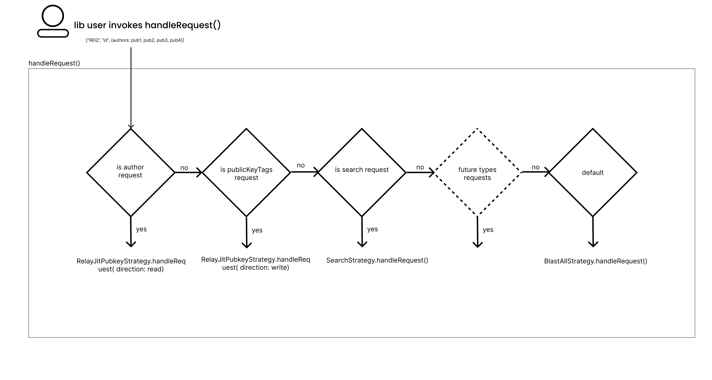

# Relay JIT Engine

The idea is to resolve relays just in time as the requests from the library user stream in.
This has the benefit that only the currently needed relays are connected, and requests get automatically split. This means that a request is sent only to the relay where it's most likely to receive an answer.
This is useful to avoid duplicate data and battery concerns on mobile devices.

## strategies

First the request handler looks at the filter in the request and decides on a strategy. \
This is done by switch case.

## pubkey strategy

This graphic shows the flow of the pubkey strategy. \

### steps

1. The request is sent to the req resolver.
2. Matching with already known pubkey relay relationships. If a relay is found, the request is sent out for the specific pubkey and the desired coverage reduced by 1.
   In this case pub1(write) and pub2(write) are found
3. Same as step 2, but read and write doesn't match. Nothing is found.
4. Pub3(write) is found. pub4 matches but in the wrong rw direction.
5. Missing coverage for pub3(write) is decreased by 1.
6. pub4(write) is still not covered. Looking in nip65 data for a relay candidate. The nip65 ranking considers already connected relays.
7. 1. A relay that is already connected covers pub4(write). Adding the relationship to the working array.
   2. No nip65 data for pub(write) is found. Fallback to blast all strategy.
   3. A relay candidate is found but not connected. Connection is established and pub4(write) is added.

## relay lost connection

This graphic shows what happens if a relay connection is lost or connection fails.

When the connection fails we try to restore the connection. If that failes we look for a new relay candiate(s), like in the previous graphic step 6-7.

## kick unused relays

Shows the concept of a relay garbage collector for rarely used relays.

Multiple websocket connections are expensive, over the lifetime of the app we might have connected relays that are dangling and not used anymore. To avoid this we introduce a usefulness score. The score is increased by 1 for every request that is sent to the relay. If the score is below a certain threshold the relay is disconnected.
